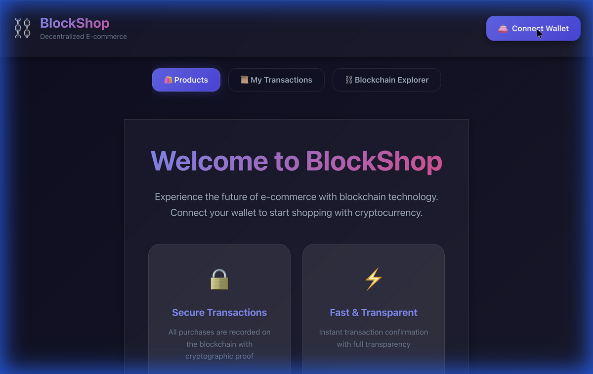
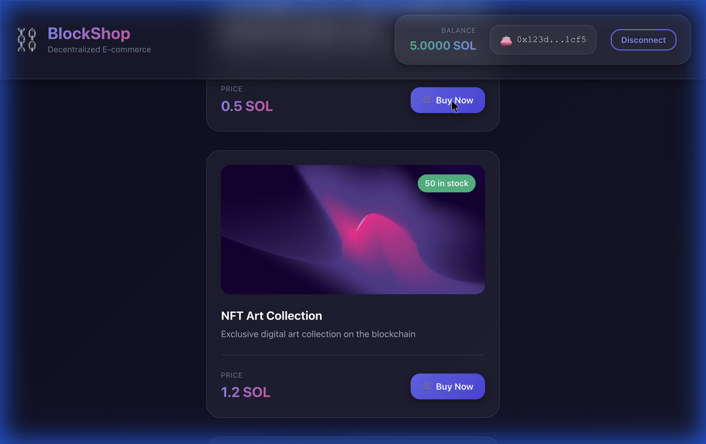
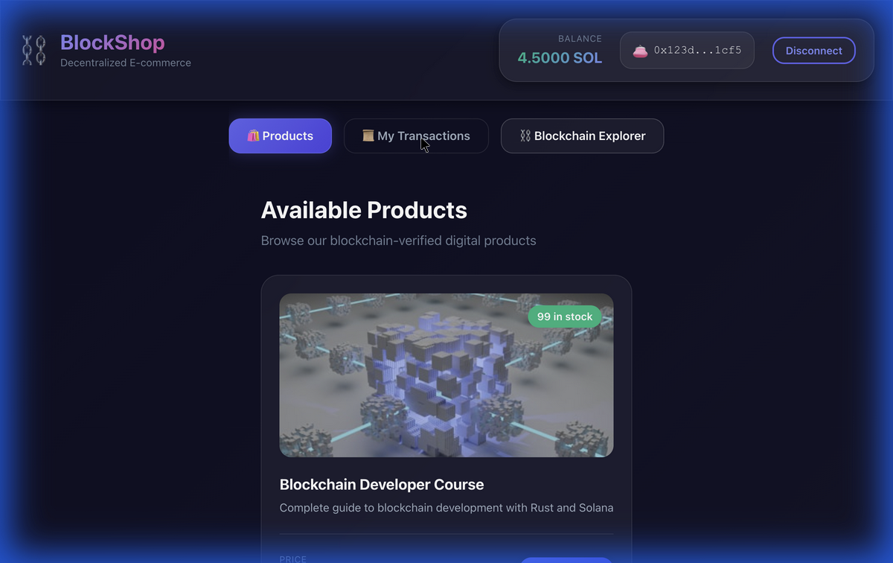
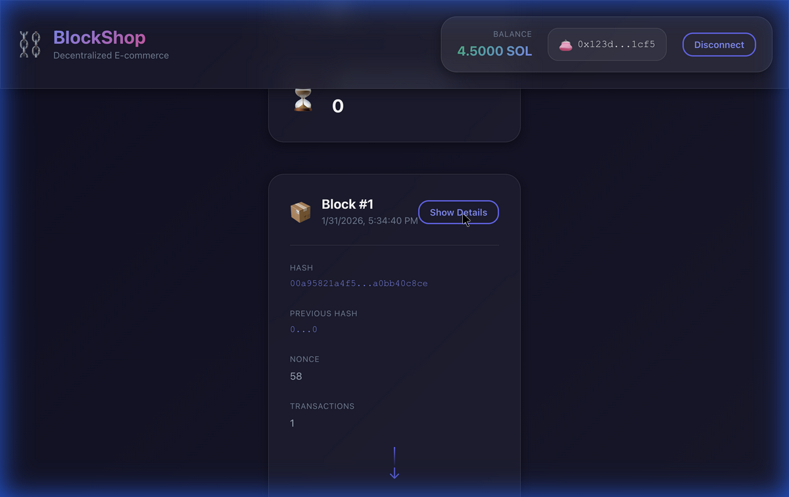

# 🛍️⛓️ BlockShop - Blockchain E-commerce Platform

A decentralized e-commerce platform built with **React** and **Rust**, featuring blockchain-based transaction processing with proof-of-work mining, cryptographic verification, and a modern glassmorphic UI.

## ✨ Features
hi

### 🔐 Blockchain Technology
- **Proof-of-Work Mining**: Each transaction is mined into a block with configurable difficulty
- **Cryptographic Hashing**: SHA-256 hashing for transaction and block verification
- **Immutable Ledger**: Complete transaction history stored on the blockchain
- **Transaction Verification**: Every purchase is cryptographically signed and verified

### 💳 Wallet Integration
- **Simulated Wallet**: Connect with a generated wallet address
- **Balance Tracking**: Real-time balance updates after transactions
- **Transaction History**: View all your purchases with complete details

### 🛒 E-commerce Features
- **Product Catalog**: Browse digital products with images, descriptions, and pricing
- **Real-time Stock Management**: Automatic stock updates after purchases
- **Instant Transactions**: Fast blockchain transaction processing
- **Purchase Notifications**: Success/error feedback for all transactions

### 📊 Blockchain Explorer
- **Block Viewer**: Inspect all blocks in the chain
- **Transaction Details**: View transaction data including hashes, amounts, and addresses
- **Genesis Block**: Special visualization for the first block
- **Block Statistics**: Track total blocks, difficulty, and pending transactions

## 🎨 Design Highlights

- **Modern Dark Theme**: Sleek dark interface with vibrant accent colors
- **Glassmorphism Effects**: Frosted glass cards with backdrop blur
- **Smooth Animations**: Micro-interactions and transitions throughout
- **Responsive Layout**: Works seamlessly on desktop and mobile
- **Premium Typography**: Clean, modern font hierarchy

## 🏗️ Architecture

### Backend (Rust)
```
blockchain-ecommerce/backend/
├── src/
│   └── main.rs          # Blockchain logic + REST API
├── Cargo.toml           # Dependencies
└── target/              # Compiled binaries
```

**Tech Stack:**
- `actix-web` - High-performance web framework
- `serde` - Serialization/deserialization
- `sha2` - SHA-256 cryptographic hashing
- `chrono` - Timestamp handling
- `uuid` - Unique ID generation

**Key Components:**
- **Blockchain**: Proof-of-work implementation with mining
- **Block**: Contains transactions, hash, previous hash, nonce
- **Transaction**: Product purchases with buyer/seller addresses
- **REST API**: Endpoints for products, purchases, blockchain data

### Frontend (React)
```
blockchain-ecommerce/frontend/
├── src/
│   ├── components/
│   │   ├── WalletConnection.jsx      # Wallet UI
│   │   ├── ProductList.jsx           # Product catalog
│   │   ├── TransactionHistory.jsx    # Purchase history
│   │   └── BlockchainViewer.jsx      # Block explorer
│   ├── App.jsx                       # Main app component
│   ├── index.css                     # Design system
│   └── main.jsx                      # Entry point
└── package.json
```

**Tech Stack:**
- `React 18` - UI framework
- `Vite` - Build tool and dev server
- Modern CSS with custom properties

## 🚀 Getting Started

### Prerequisites
- **Rust** (1.70+) - [Install Rust](https://rustup.rs/)
- **Node.js** (18+) - [Install Node.js](https://nodejs.org/)
- **Cargo** - Comes with Rust installation

### Installation

1. **Clone the repository**
```bash
cd /path/to/blockchain-ecommerce
```

2. **Start the Backend (Rust)**
```bash
cd backend
cargo run
```

The backend will start on `http://localhost:8080`

You should see:
```
🚀 Starting Blockchain E-commerce Backend...
📦 Initializing blockchain and products...
✅ Server running at http://localhost:8080
📡 API Endpoints:
   GET  /api/products - List all products
   POST /api/purchase - Purchase a product
   GET  /api/blockchain - View blockchain
   GET  /api/transactions - View all transactions
```

3. **Start the Frontend (React)**

Open a new terminal:
```bash
cd frontend
npm install  # First time only
npm run dev
```

The frontend will start on `http://localhost:5173`

4. **Open the Application**

Navigate to `http://localhost:5173` in your browser.

## 📸 Screenshots

### Wallet Connection

*Connect your wallet to start shopping with cryptocurrency*

### Product Catalog

*Browse and purchase digital products with blockchain transactions*

### Transaction History

*View all your purchases with complete transaction details*

### Blockchain Explorer

*Explore blocks and transactions on the chain*

## 🔌 API Endpoints

### GET `/api/products`
Returns all available products.

**Response:**
```json
[
  {
    "id": "uuid",
    "name": "Product Name",
    "description": "Product description",
    "price": 0.5,
    "stock": 100,
    "image_url": "https://..."
  }
]
```

### POST `/api/purchase`
Purchase a product and create a blockchain transaction.

**Request:**
```json
{
  "product_id": "uuid",
  "buyer_address": "0x...",
  "quantity": 1
}
```

**Response:**
```json
{
  "success": true,
  "transaction_id": "uuid",
  "transaction_hash": "sha256_hash",
  "message": "Successfully purchased Product x1"
}
```

### GET `/api/blockchain`
Returns the entire blockchain with all blocks.

**Response:**
```json
{
  "chain": [
    {
      "index": 0,
      "timestamp": 1234567890,
      "transactions": [],
      "previous_hash": "0",
      "hash": "genesis_hash",
      "nonce": 0
    }
  ],
  "pending_transactions": [],
  "difficulty": 2
}
```

### GET `/api/transactions`
Returns all transactions from all blocks.

**Response:**
```json
[
  {
    "id": "uuid",
    "product_id": "uuid",
    "buyer_address": "0x...",
    "seller_address": "0x...",
    "amount": 0.5,
    "timestamp": 1234567890,
    "hash": "tx_hash",
    "previous_hash": "prev_hash",
    "nonce": 0
  }
]
```

## 🔧 How It Works

### 1. Wallet Connection
- User clicks "Connect Wallet"
- Frontend generates a simulated wallet address (0x...)
- Initial balance of 5.0 SOL is assigned

### 2. Product Purchase
- User browses products and clicks "Buy Now"
- Frontend sends POST request to `/api/purchase`
- Backend creates a transaction with:
  - Product details
  - Buyer/seller addresses
  - Amount and timestamp
  - Cryptographic hash

### 3. Block Mining
- Transaction is added to pending transactions
- Backend mines a new block using proof-of-work:
  - Increments nonce until hash starts with required zeros
  - Difficulty level determines mining complexity
- Block is added to the blockchain

### 4. Verification
- User can view transaction in "My Transactions"
- User can inspect block details in "Blockchain Explorer"
- All hashes are verifiable and immutable

## 🎯 Technical Highlights

### Proof-of-Work Algorithm
```rust
fn mine_block(&self, transactions: Vec<Transaction>, previous_hash: String) -> Block {
    let mut nonce = 0;
    loop {
        let hash = Self::calculate_hash(index, timestamp, &transactions, &previous_hash, nonce);
        if hash.starts_with(&"0".repeat(self.difficulty)) {
            return Block { /* ... */ };
        }
        nonce += 1;
    }
}
```

### SHA-256 Hashing
```rust
fn calculate_hash(/* ... */) -> String {
    let data = format!("{}{}{:?}{}{}", index, timestamp, transactions, previous_hash, nonce);
    let mut hasher = Sha256::new();
    hasher.update(data.as_bytes());
    hex::encode(hasher.finalize())
}
```

### React State Management
- Wallet state managed in App component
- Real-time balance updates on purchase
- Refresh triggers for transaction/blockchain updates

## 🎨 Design System

### Color Palette
- **Primary**: `#6366f1` (Indigo)
- **Secondary**: `#ec4899` (Pink)
- **Accent**: `#10b981` (Green)
- **Background**: Dark gradient (`#0f0f23` → `#1a1a2e`)

### Typography
- **Font**: Inter, system fonts
- **Headings**: Bold, gradient text
- **Body**: Clean, readable hierarchy

### Effects
- **Glassmorphism**: `backdrop-filter: blur(20px)`
- **Shadows**: Multi-layered with glow effects
- **Animations**: Smooth transitions (250ms ease)

## 🧪 Testing

The application has been fully tested with:
- ✅ Wallet connection and disconnection
- ✅ Product listing and display
- ✅ Purchase transactions with balance updates
- ✅ Transaction history filtering
- ✅ Blockchain explorer with block details
- ✅ Stock management and validation
- ✅ Error handling (insufficient balance, out of stock)

## 🚧 Future Enhancements

- [ ] Real blockchain integration (Solana/Ethereum)
- [ ] Smart contract deployment
- [ ] MetaMask wallet support
- [ ] Product reviews and ratings
- [ ] Shopping cart with multiple items
- [ ] Order fulfillment system
- [ ] Admin dashboard for sellers
- [ ] Multi-currency support
- [ ] NFT product listings
- [ ] Decentralized storage (IPFS)

## 📝 License

This is a demonstration project for educational purposes.

## 🤝 Contributing

This is a demo project, but feel free to fork and experiment!

## 📧 Contact

Built with ❤️ using React and Rust

---

**⚠️ Important Note**: This is a demonstration project using a simulated blockchain. For production use, integrate with real blockchain networks like Solana, Ethereum, or Near Protocol.
# Rust-BlockChainProject
